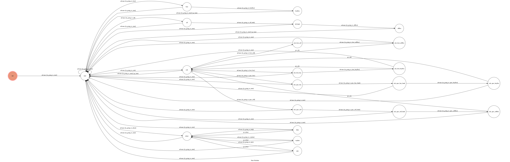

# ExRateBot_telegram

A telegram bot based on a finite state machine which can search exchange rate and calculate the exchanging result.

## Setup

### Prerequisite
* Python 3

#### Install Dependency
```sh
pip install -r requirements.txt
```

* pygraphviz (For visualizing Finite State Machine)
    * [Setup pygraphviz on Ubuntu](http://www.jianshu.com/p/a3da7ecc5303)

### Secret Data

`API_TOKEN` and `WEBHOOK_URL` in app.py **MUST** be set to proper values.
Otherwise, you might not be able to run your code.

### Run Locally
You can either setup https server or using `ngrok` as a proxy.

**`ngrok` would be used in the following instruction**

```sh
./ngrok http 5000
```

After that, `ngrok` would generate a https URL.

You should set `WEBHOOK_URL` (in app.py) to `your-https-URL/hook`.

#### Run the sever

```sh
python3 app.py
```

## Finite State Machine


## Usage
The initial state is set to `init`, it will goto `start` state whne press start button.
The bot has 4 section in main menu:
1. Best exchange rate: can search the best exchange rate and bank name of TWD to another currency.
2. All exchange rate: can search exchange rate in all of the banks.
3. Calculate: can calculate TWD to another currency or another currency to TWD with the best bank exchange rate or a Specified bank exchage rate.
4. About: there ara help instruction, some knowledge of exchanging, reference, and author information. 

You just need to press the blue words on screen instead of enter message.
(Calculate section still need to enter the number of money.)

## Reference
Template Code for TOC Project 2017 Author: [Lee-W](https://github.com/Lee-W)
